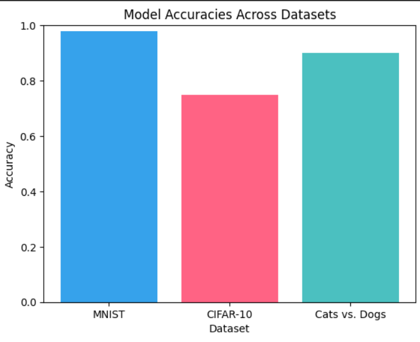
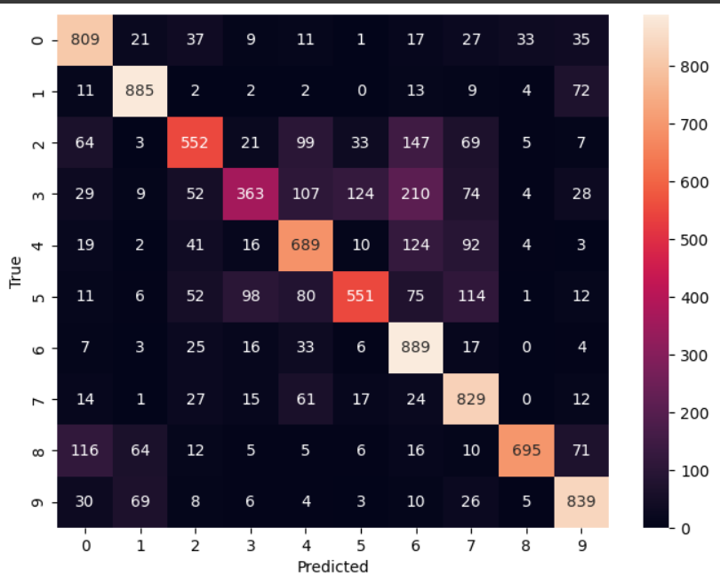
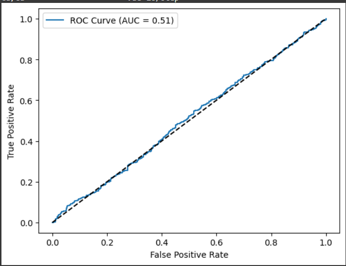
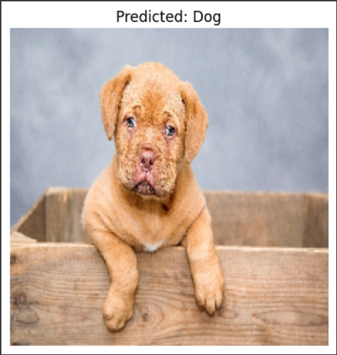

# Vision AI Bootcamp – Image Recognition Project

This repository contains my final project from the **Vision AI Bootcamp**, where I implemented image classification models using **TensorFlow/Keras** in **Google Colab**. The project progresses from basic CNNs to an optimized transfer learning model for **Cats vs. Dogs**.

## 📂 Datasets Used
- **MNIST** – Handwritten digit recognition
- **CIFAR-10** – 10-class object recognition
- **Cats vs. Dogs** – Binary classification

## 🛠️ Models Implemented
1. **Custom CNNs** for MNIST and CIFAR-10 with Dropout & Batch Normalization
2. **Transfer Learning** with MobileNetV2 for Cats vs. Dogs
3. Fine-tuning for improved accuracy

## 📊 Results & Visualizations

### Model Accuracies Across Datasets


### Confusion Matrix Example


### ROC Curve


## 🚀 Features
- Image preprocessing & augmentation
- Model evaluation with accuracy, precision, recall, F1-score, ROC-AUC
- Visualizations for metrics and results
- Google Colab compatible code

## 📦 How to Run
```bash
# Clone this repository
git clone https://github.com/gauravsoni02/IMAGE_RECOGNITION_AI
cd vision-ai-project

# Open the notebook in Google Colab and run
```
Upload an image to test predictions with the trained Cats vs. Dogs model.

## 📌 Example Prediction


---
## Key Features
-Download and preprocess Kaggle datasets (MNIST, CIFAR-10, Cats & Dogs)
-Visualize datasets with Matplotlib
-Build, train, and evaluate custom CNNs with Keras
-Implement data augmentation and batch normalization
-Apply transfer learning (MobileNetV2)
-Model evaluation: confusion matrix, classification report, ROC/AUC
-Includes code for saving, loading, and deploying models


## Highlights
-Accuracy on MNIST: >99%
-Accuracy on CIFAR-10: ~69%
-Cats vs. Dogs (Transfer Learning): ~88% training accuracy
-Visualization: Sample predictions, confusion matrix, ROC curves


## Skills Demonstrated
-Deep Learning / CNNs
-Data preprocessing & augmentation
-Model evaluation & visualization
-Transfer learning (fine-tuning)
-TensorFlow / Keras
-Google Colab & Kaggle integration
-Git version control


## Recruiter Note
This project demonstrates my practical skills in deep learning, my ability to create reproducible ML pipelines, and my experience with industry-standard tools. I'm passionate about building and deploying impactful AI solutions.

## Contact
-Feel free to connect on LinkedIn
**Author:** Gaurav Soni 
**Bootcamp:** Vision AI in 5 Days – DevTown
